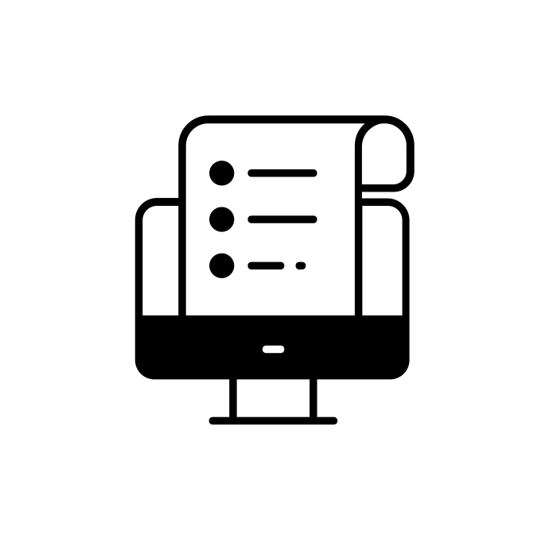

💻 📑 🧬 🗄️ 🦀 🐍 📊 🗺️

List of things to do
* ☕️ Have coffee
* 📝 Read and write abstracts, papers and code
* ⚙️ Build figures, documentation, diagrams, databases, models, APIs and notebooks
* ✔️ git push
    <!-- sit on board seats: make very important company decisions -->

`nomial.ai` is proudly creative by nature, radical in optimism and honest in everything we do -> built in New Jersey (for now) <!-- The Garden State --> <!-- for now, anyway --> 

<!-- nomial.ai is a cheminformatics and bioinformatics AI/ML company -->
<!-- soon: chem.nomial.ai & bio.nomial.ai -->
<!-- we absolutely love working extra hard on saturdays, one of the most productive days of the week, esp the mornings for meetings on electronic devices such as computers/laptops using electricity. we are an AI company afterall, we love electricity, all 7 days of the week. -->
<!--  we are always working/thinking/writing/reading, 7 days a week, no matter what, and as my 11th grade java programming teacher in hs said (also 12th grade a.p. computer science teacher): "you should be able to traverse an array in your sleep & iterate a for loop in your sleep" even when im sleeping, im thinking -->
<!-- it is important to understand, small gains are still gains that lead to something great, GS7CxAtV5Ks "i loved every minute of it, however hard it had been" what a great quote to describe something that is worth it, something worth solving. what i wanted this yr, i did not get, but i was redirected into more math bc i took a chance by taking calc 3, i am grateful for that, i think its a massive step in the right direction, which is fine. is it exactly what i thought would happen this yr, no, but is it for the better, yes, i believe so. -->
<!-- if u don't try, u will not know. sometimes u dont want to know. sometimes uve made the decision already on what its going to be. but, if u dont try, u will not know. it was just 8 weeks of calc 3, and it changed so much. -->
<!-- money is a great motivator & it's also great comfort, it's fine to sit around laughing at lunch (10 yrs ago, that was comfort & that is fine sometimes), but that needed to end (that was my prerogative) bc i (always) wanted to do more and i knew that. there's always more money around the corner & then there's also never enough of it, it's all very complicated. but if u have the option to do what u want, not for anyone else, go for what __u__ want.
<!--
📍 Our most beautiful days: we haven’t seen yet.
Nazım Hikmet
-->
